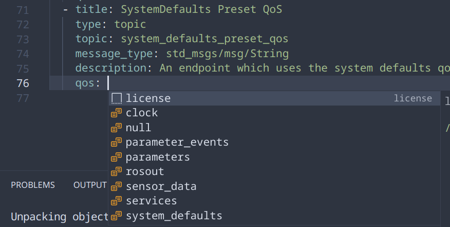

### redf

`redf` stands for "ROS Endpoint Definition Format", it defines a yaml format which describes the endpoints of a ROS system.

### Supported Distros

`redf` currently supports galactic and humble.

### Why use redf?

A common problem of ROS is that it only contains message definitions, there is no definition of the topics available and their QoS settings expected. `redf` aims to solve this by defining the endpoints in a yaml file and generating code so that other packages will not have wrong topics and mismatched QoS.

Currently `redf` can:
* Generate a rclcpp based ROS package with the topics, services, actions and their QoS

Other planned features includes:
* Generate documentations
* Generate a rclpy based package
* Integrate with the rosidl codegen
* Integrate with rcl

### Example

An example redf file

```yaml
title: Test Api
description: test api
version: 0.0.1
maintainers:
  - name: example
    email: example@example.com
license: Apache License 2.0
endpoints:
  - title: My Sensor
    type: topic
    topic: my_sensor
    message_type: std_msgs/msg/String
    description: Example sensor topic
    qos: sensor_data
```

Generate a ROS package from the yaml

```bash
redf --out=out --gen=cpp example.yaml
```

This will generate a full, ready-to-use ROS package, it can be included into a colcon workspace and be used by other packages.

An example of using the endpoint definitions:

cmake:
```cmake
cmake_minimum_required(VERSION 3.16)
project(test_node)

find_package(rclcpp REQUIRED)
find_package(test_api REQUIRED)

add_executable(test_node main.cpp)
target_link_libraries(test_node rclcpp::rclcpp test_api::test_api)
```

main.cpp:
```cpp
#include <test_api.hpp>
#include <rclcpp/rclcpp.hpp>

int main(int argc, char* argv[]) {
  rclcpp::init(argc, argv);
  auto test_node = rclcpp::Node::make_shared("test_node");

  using test_api::MySensor;
  auto pub = test_node->create_publisher<MySensor::MessageType>(MySensor::topic_name(), MySensor::qos());
  MySensor::MessageType msg;
  msg.data = "hello";
  pub->publish(msg);

  return 0;
}
```

### Redf Format

The full format of `redf` is available as a json schema [here](./redf.schema.json).

You can also generate the schema from source with

```bash
cargo run -F json_schema --bin generate-schema
```

### Code Completion (vscode)

**TODO: These instructions are for when the repo is public, you need to download the schema and point to it locally for now.**

1. Install the yaml extension https://marketplace.visualstudio.com/items?itemName=redhat.vscode-yaml

1. Edit your vscode settings to include this

```json
"yaml.schemas": {
  "https://raw.githubusercontent.com/osrf/redf/main/redf.schema.json": "*.redf.yaml"
}
```

3. Make sure your filename ends with `.redf.yaml`.

You should now have code completion for redf



### Running Tests

Requirements:
* supported ros distro
* rosdeps
  * ament_cmake
  * std_msgs
  * example_interfaces
  * rclcpp

Use `rosdep` to resolve and install the dependencies

```bash
rosdep resolve -q ament_cmake std_msgs example_interfaces rclcpp | sed '/^#/d' | xargs sudo apt install
```

Source ROS and run the tests

```bash
. /opt/ros/{DISTRO}/setup.bash && cargo test
```
